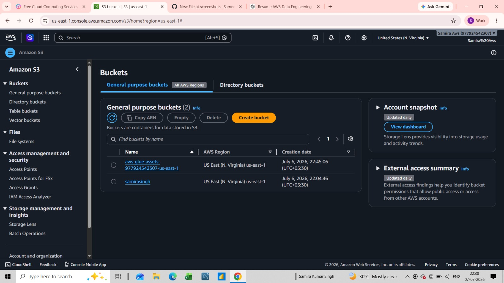
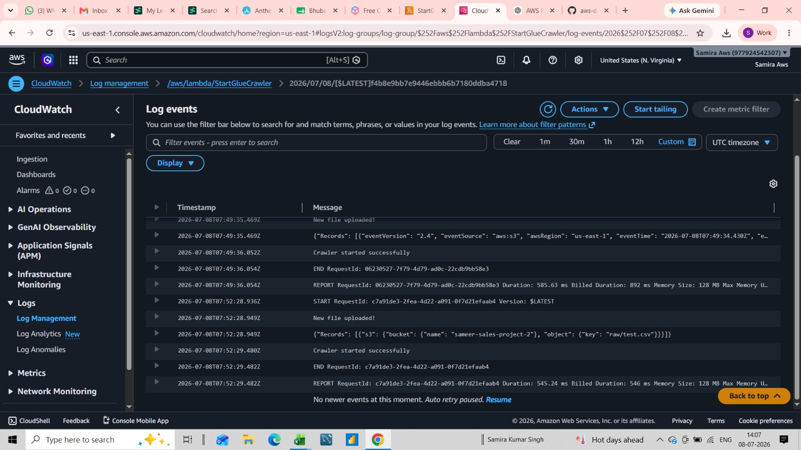
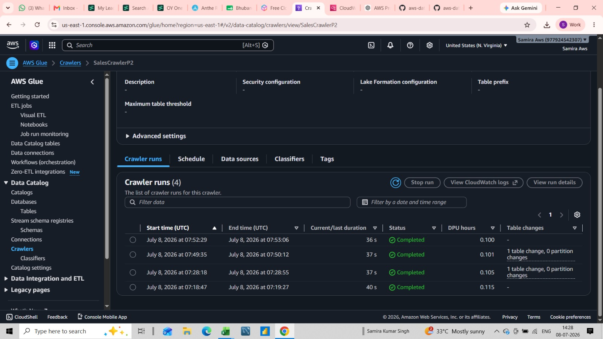
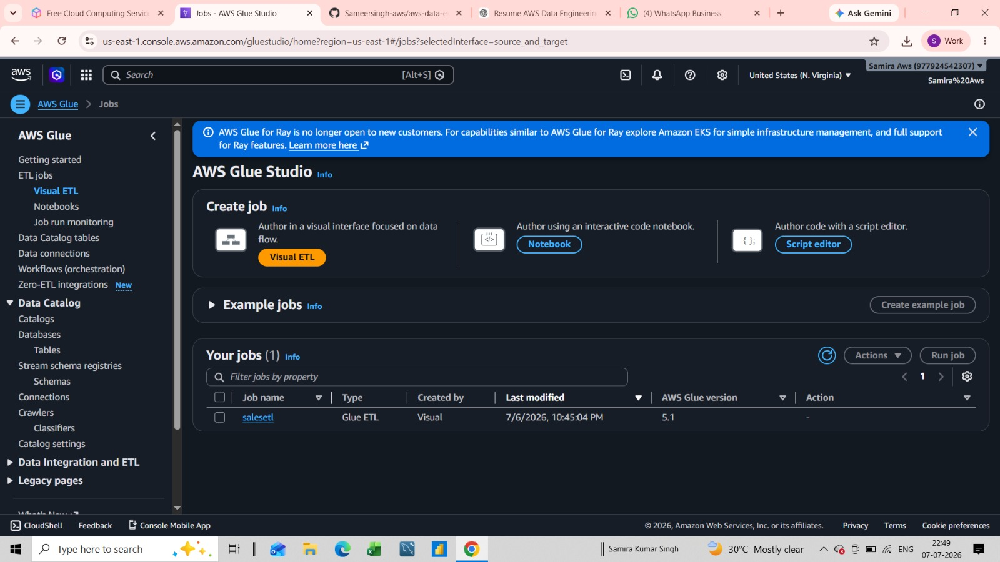
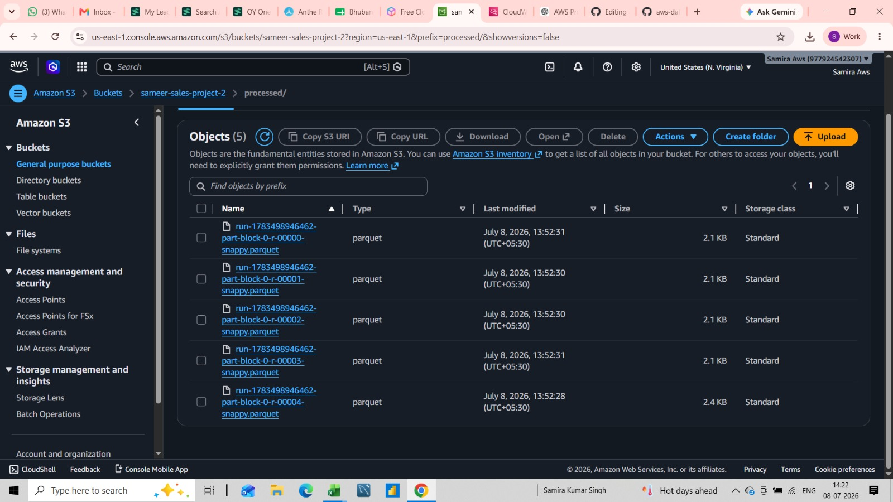
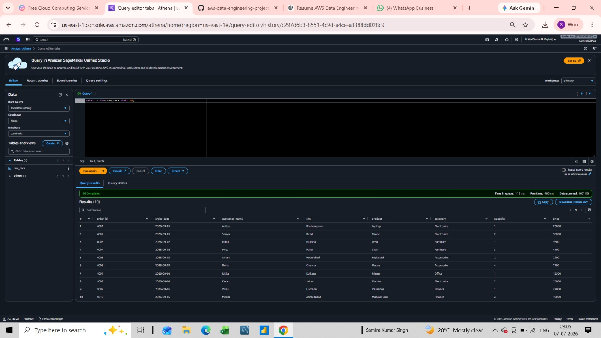

# End-to-End AWS Data Engineering Project

## Project Overview

This project demonstrates an end-to-end AWS Data Engineering pipeline that automatically processes CSV files uploaded to Amazon S3.

The pipeline is event-driven using AWS Lambda, catalogs data with AWS Glue Crawler, transforms CSV files into Parquet format using AWS Glue ETL, and enables SQL analytics through Amazon Athena.

---

## Architecture

          +----------------+
          |    User        |
          +----------------+
                  |
                  | Upload CSV
                  v
      +-------------------------+
      | Amazon S3 (raw folder)  |
      +-------------------------+
                  |
          S3 Event Trigger
                  |
                  v
      +-------------------------+
      | AWS Lambda              |
      | Start Glue Crawler      |
      +-------------------------+
                  |
                  v
      +-------------------------+
      | AWS Glue Crawler        |
      +-------------------------+
                  |
                  v
      +-------------------------+
      | Glue Data Catalog       |
      +-------------------------+
                  |
                  v
      +-------------------------+
      | Glue Studio ETL Job     |
      | Select Fields           |
      | Convert to Parquet      |
      +-------------------------+
                  |
                  v
      +-------------------------+
      | Amazon S3 (processed/)  |
      +-------------------------+
                  |
                  v
      +-------------------------+
      | Amazon Athena           |
      | SQL Analysis            |
      +-------------------------+


---

## AWS Services Used

- Amazon S3
- AWS Lambda
- AWS Glue Crawler
- AWS Glue Data Catalog
- AWS Glue Studio (Visual ETL)
- Amazon Athena
- IAM
- CloudWatch

---

## Project Workflow

1. Upload CSV files to the **raw/** folder in Amazon S3.
2. Amazon S3 triggers an AWS Lambda function.
3. Lambda starts the AWS Glue Crawler.
4. Glue Crawler updates the Glue Data Catalog.
5. AWS Glue ETL Job reads the catalog table.
6. Data is transformed into Parquet format.
7. Output is stored in the **processed/** folder in Amazon S3.
8. Amazon Athena queries the processed data using SQL.

---

## Repository Structure

```
aws-data-engineering-project/
│
├── architecture/
├── dataset/
├── documentation/
├── glue-job/
├── lambda/
├── screenshots/
├── sql/
└── README.md
```

---

## Screenshots

### Amazon S3



### AWS Lambda



### Glue Crawler



### Glue ETL Job



### Processed Parquet Files



### Amazon Athena



---

## Technologies

- Python
- SQL
- Amazon S3
- AWS Lambda
- AWS Glue
- Amazon Athena
- IAM
- CloudWatch

---

## Sample Athena Queries

```sql
SELECT * FROM sales LIMIT 10;

SELECT SUM(amount)
FROM sales;

SELECT city, SUM(amount)
FROM sales
GROUP BY city;

SELECT product, COUNT(*)
FROM sales
GROUP BY product;
```

---

## Skills Demonstrated

- Event-driven architecture
- Serverless computing
- Data cataloging
- ETL pipeline development
- Data transformation
- SQL analytics
- AWS IAM permissions
- CloudWatch monitoring

---

## Future Improvements

- Amazon QuickSight Dashboard
- EventBridge Scheduling
- SNS Email Notifications
- Partitioned Parquet Data
- CI/CD using GitHub Actions

---

## Author

**Sameer Singh**

AWS | SQL | Python | Data Engineering
